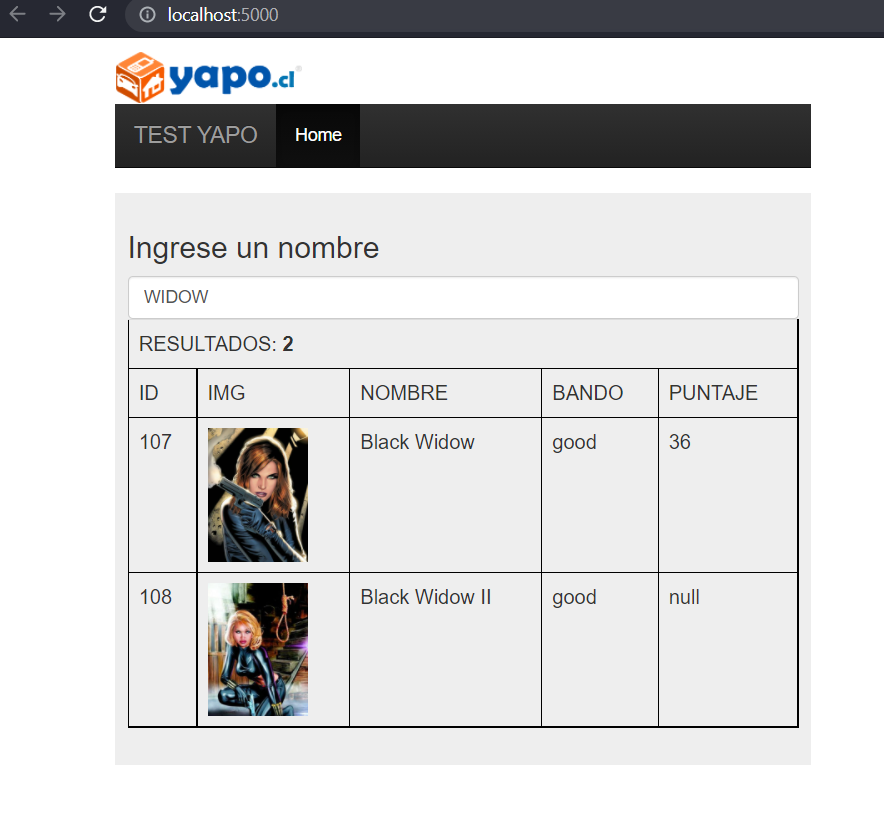
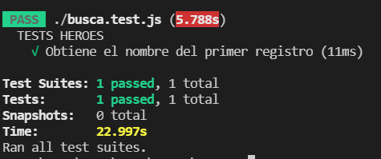

# YAPO_HEROES


## PRE-REQUISITOS
- Git
- Docker
- Node JS
- WIndows 10
## INSTALACION
1. Crear carpeta local que contendrá la aplicacion (Ej: C:\ACM_TEST)
2. Dentro de ACM_TEST abrir consola de comandos y ejecutar : 
```sh
C:\ACM_TEST> git clone https://github.com/FIXDISC/yapo_heroes.git
```
3. Acceder a la carpeta del proyecto yapo_heroes e instalar dependencias :
```sh
cd C:\ACM_TEST\yapo_heroes\
```
```sh
C:\ACM_TEST\yapo_heroes> npm install
```
4. Generar el contenedor :
```sh
C:\ACM_TEST\yapo_heroes> docker build -t yapo_heroes .
```
5. Desplegar la imagen con el proyecto:
```sh
C:\ACM_TEST\yapo_heroes> docker run -it -p 5000:5000 yapo_heroes
```
6. Iniciar el proyecto y navegar en el browser a la url (http://localhost:5000): 
```sh
C:\ACM_TEST\yapo_heroes> npm start
```
   http://localhost:5000   
7. Al ingresa texto debe desplegar listado de coincidencias:  
   

## TESTING
Generar pruebas desde la linea de comandos :
```sh
C:\ACM_TEST\yapo_api> npm test
```


